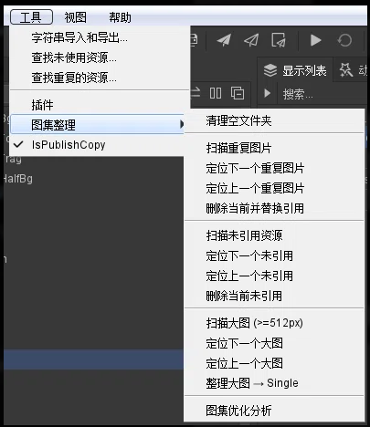

# AtlasOrganizer - 图集整理工具

FairyGUI 编辑器插件，用于 UI 图集的诊断、整理和清理。




## 功能清单

| 功能               | 说明                                                                        |
| ------------------ | --------------------------------------------------------------------------- |
| 清理空文件夹       | 扫描并删除所有包中的空文件夹                                                |
| 扫描重复图片       | 基于 MD5 检测跨包重复图片，支持逐组定位、一键替换引用并删除                 |
| 扫描未引用资源     | 检测全局未被任何组件引用的图片/Sprite，支持逐个定位和删除                   |
| 扫描大图 (>=512px) | 找出未放入 Single 文件夹的大尺寸图片，支持一键移动到 /Images/Single/        |
| 图集优化分析       | 诊断混用（被其他包引用）、分散（组件引用 3+ 图集）、未分配（默认 auto）问题 |

## 使用方式

菜单路径：**工具 → 图集整理**

### 重复图片工作流

1. 执行「扫描重复图片」
2. 使用「定位下一个/上一个重复图片」逐组浏览
3. 确认后使用「删除当前并替换引用」自动将引用指向保留项

### 未引用资源工作流

1. 执行「扫描未引用资源」
2. 使用「定位下一个/上一个未引用」逐个浏览
3. 确认后使用「删除当前未引用」清理

### 大图整理工作流

1. 执行「扫描大图」
2. 浏览确认后执行「整理大图 → Single」
3. 自动移动到 /Images/Single/ 并设置 alone_npot，清理空源文件夹

### 图集优化分析

执行后在控制台输出诊断报告，包含三类问题：

- **混用问题**：图片被其他包的组件引用（Common/Icon 包除外），导致修改时重编不相关图集
- **分散问题**：单个组件引用 3 个以上不同图集编号，造成额外 DrawCall
- **未分配图集**：文件夹未指定 atlas 编号，使用默认 auto

## 文件结构

```
AtlasOrganizer/
├── main.lua                      ← 插件入口（菜单注册、模块加载、生命周期）
├── src/
│   ├── utils.lua                 ← 公共工具函数
│   ├── clean_empty_folders.lua   ← 功能1: 清理空文件夹
│   ├── scan_duplicate.lua        ← 功能2: 扫描重复图片
│   ├── scan_unused.lua           ← 功能3: 扫描未引用资源
│   ├── scan_large.lua            ← 功能4: 扫描大图
│   └── analyze_atlas.lua         ← 功能5: 图集优化分析
├── package.json                  ← 插件描述
├── atlas_rules.md                ← 图集目录存放规范（交付美术）
└── README.md                     ← 本文件
```

## 相关文档

- [atlas_rules.md](atlas_rules.md) — UI 切图存放目录规则
